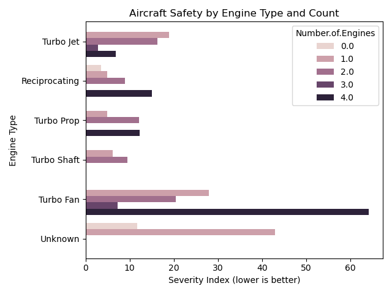
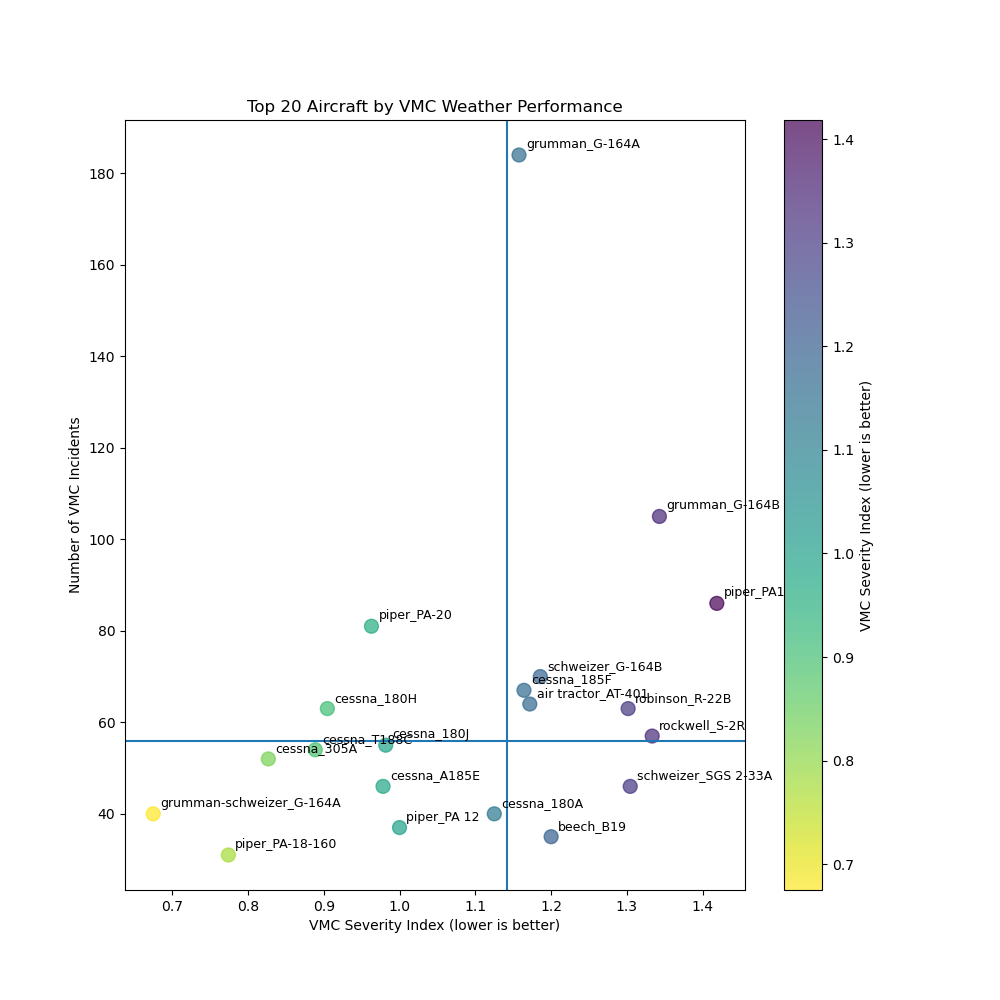

# Aviation Accident Analysis: Identifying Low-Risk Aircraft Options

**Author**: [Lewis Mwaki](https://github.com/lewismwaki)

## Overview

This project analyzes historical aviation accident data to identify low-risk aircraft options for a company entering the aviation industry. By analyzing over 80,000 incidents spanning several decades, the project identifies specific aircraft models, engine configurations, and operational types that demonstrate superior safety profiles. This data-backed analysis provides actionable recommendations to the Head of Aviation Division, enabling confident and informed investment decisions that prioritize safety while meeting business objectives.

## Business Problem

Our company is venturing into aviation with no prior experience in the industry or knowledge of aircraft models. This presents significant risk both to our capital investments and, more importantly, to the lives of our customers and personnel. The Head of the Aviation Division needs data-driven insights to guide aircraft acquisition decisions, focusing on identifying models with proven safety records that align with our operational needs.

## Data

The analysis uses the NTSB Aviation Accident Database, one of the most comprehensive aviation incident datasets available. Key features include:
- Historical records spanning from 1923 to 2022
- Over 82,000 distinct accident records
- 31 data columns including aircraft specifications, weather conditions, injury severity, and flight purpose
- US-based incidents, providing consistency in reporting standards

Data source: [Aviation Accident Database on Kaggle](https://www.kaggle.com/datasets/khsamaha/aviation-accident-database-synopses/data)

## Methods

This project focusing on comparing safety metrics against different aircraft features, types and configurations.
- Development of a custom Severity Index that weights different injury types
- Comparative analysis across engine types, aircraft models, and operational purposes
- Weather condition performance analysis (IMC vs. VMC)
- Visualization of safety metrics to identify patterns and outliers

## Results

Analysis revealed clear patterns in aircraft safety profiles across different configurations and conditions:

### Engine Type Safety Analysis

The analysis showed that certain engine configurations consistently demonstrate better safety records:

### Aircraft Performance in Different Weather Conditions

Some aircraft models showed remarkable resilience in challenging weather conditions:

## Conclusions

Our comprehensive analysis yields three key recommendations for aircraft acquisition:

1. **Prioritize specific engine configurations**: Three-engine turbojets and single-engine reciprocating configurations demonstrated the lowest risk profiles across multiple metrics.

2. **Match aircraft to operational purpose**: Models like Cessna 180/185 series and Piper PA-28 variants show excellent safety records for personal and instructional use, while other models are better suited for specialized operations.

3. **Consider weather resilience in acquisition decisions**: If operations will take place in regions with frequent IMC (Instrument Meteorological Conditions), select models that demonstrate superior performance in these conditions, such as certain Beechcraft and Cessna models.

## Next Steps

To build upon this analysis and continue developing our aviation strategy:

 - **Develop specialized pilot training programs** tailored to our selected aircraft and flight purposes
 - **Analyze additional risk factors** beyond those covered in this study

## For More Information

See the full analysis in the [Jupyter Notebook](./aviation_accidents_analysis.ipynb) or review the presentation in the [presentation folder](./presentation/).

## Repository Structure

├── .gitignore                          # Git ignore file for large datasets
├── aviation_accidents_analysis.ipynb   # Main analysis notebook
├── dashboard/                          # Dashboard files
├── data/                              # Data files directory
│   ├── AviationData.csv               # Main aviation accident dataset
│   └── USState_Codes.csv              # US state reference data
├── images/                            # Visualization outputs
│   ├── IMC_VMC_Severity.png           # Weather condition analysis
│   ├── Incident_Count_vs_Aircraft.png  # Aircraft incident frequency
│   ├── Severity.Index_vs_Aircraft.png  # Aircraft safety metrics
│   ├── Severity.Index_vs_EngineType.png # Engine safety comparison
│   └── title.png                      # Project title image
├── presentation/                      # Presentation materials
└── README.md                         # Project overview (this file)

todo
notebook structure 

- [x] Title  
---
- [x] Introduction
---
- [x] Business Problem Statement
---
- [x] Objectives (mention 3-5 risk factors to analyze)
---
- [x] Data Understanding
---
- [x] Data Cleaning and Normalization
 - handle missing values
 - handle outliers //todo
 - normalize date/time or categorization
---
- [x] Objectives (analyze risk factors mentioned)
 - intro and goal of objective
 - analyze
 - visualize findings
 - business recommendations towards the problem statement
 
---
- [x] Revisit objectives with new findings
---
- [x] Conclusion
---
- [x] Next Steps

deliverables checklist to follow

- [x] readme summary and pdf
- [x] jupyter notebook and pdf
- [ ] tableau dashboard images
- [ ] slides and pdf 